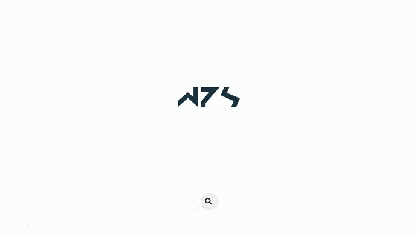

<div align="center">
    <br/>
    
    <br>
</div>

<br/>

# SvelteKit Contacts

Welcome to SvelteKit Contacts! This project is a simple contacts list application built with SvelteKit.

## Getting Started

### Prerequisites

Before you begin, ensure you have the following installed:

- Node.js
- npm (Node Package Manager)

### Installation

1. Clone the repository:

   ```bash
   git clone https://github.com/pachecowillians/sveltekit-contacts.git
   ```

2. Navigate to the project directory:

   ```bash
   cd sveltekit-contacts
   ```

3. Install dependencies:

   ```bash
   npm install
   ```

### Running the Application

To run the application locally, use the following command:

```bash
npm run dev
```

This will start the development server, and you can access the application at [http://localhost:5000](http://localhost:5000).

### Linting and Formatting

To ensure code quality, we use ESLint and Prettier. Run the following commands to lint and format the code:

```bash
# Run ESLint
npm run lint

# Run Prettier
npm run format
```

### Building for Production

To build the application for production, use the following command:

```bash
npm run build
```

The production-ready files will be generated in the `build` directory.